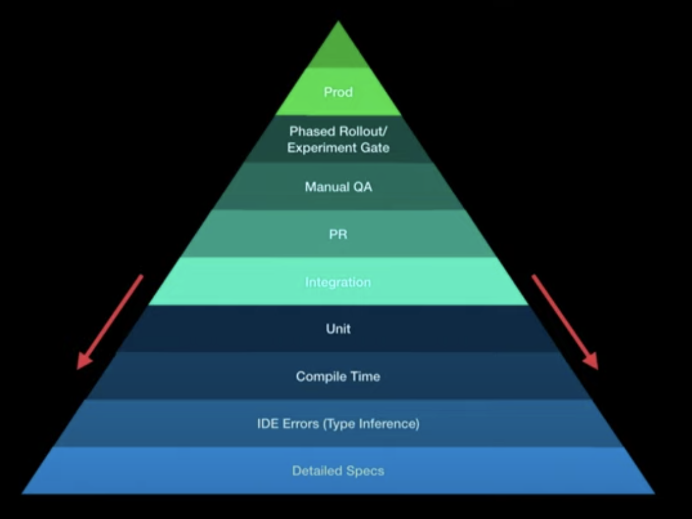

# A brief overview of the stack

I promised that the insights in this series won't get too technical.
However, I think it might be interesting for some readers to get a brief overview of the tech stack.

Let me start by saying that we always had complete freedom of the stack we are using.
We had no restrictions when choosing language, framework or whatsoever.
The only "restriction" we had was choosing where our data is hosted - it must be within Europe to guarantee GDPR and so on.
Additionally, there were some common security guidelines like encrypting customer related data, but that should be the common practice anyway and it did not restrict us.

## Codebase

Each project has its own git repository.
We are not using monorepositories and have never done so.
We haven't specifically decided not go for monorepositories, it just started this way and works great for us, and we didn't see a reason to switch so far.

The repositories are hosted in a company-managed Bitbucket.
However, we plan to migrate to Github.

Why?
Because the Bitbucket is managed by a small ops team within the company and bigger updates come with bigger downtimes (sometimes an entire weekend downtime).
Since Git is our source of truth for our code, and we continuously deploy from our repositories having 48+ hours of downtime is horrific.
We _can_ deploy by hand, but it takes a lot of time and is prone to errors.

The company has a paid organization in Github and the code could still be private.
The advantage is that Github has way fewer downtimes and is managed by Github itself.
No need to worry about the management.

We didn't really care about the additional features Github brings so far.
They might be the cherry on top of the cake.
The main reason for the migration is the reduced downtimes and increased reliability.
Another advantage of using Github is the omission of the required VPN connection for Bitbucket.

## Frontend/Backend/Ops

The development of the product has started September 2017 with a few freelancers and one internal employee who worked on the project on the side and tried to automate a bit.

The project started as a huge monolithic Node.js application.
The customer-facing application (the shop) was provided by another company at that point in time.
The monolithic Node.js application contained a back-office application (managing customers and contracts) written in React.
It wasn't a real SPA, React was pretty much "hacked" into the Node.js app.
In early 2018 all the backend code from that Node.js application was migrated to multiple Kotlin + Spring Boot services.

We have gone a long way since then.
3 1/2 years of development with about five developers on average (filled up with freelancers).

I will not cover continuous integration or deployment in this post.
There will be an entire post about that later on in this series.

Let's get to the current stack though.

### Frontend

We have different frontend applications:

* Employee-facing for customer/contract management/business (back-office)
* Employee-facing for product and asset management (PIM)
* Customer-facing (shop)
* Dashboard for developers

The back-office application that started as Node.js backend and hacky React application is now a pure React SPA with Semantic UI for a consistent user interface.
The application is built on top of [Create React App](https://github.com/facebook/create-react-app), which offers a modern web application setup without configuration (no need to configure Webpack and such).

The shop and PIM were built in 2019.

The shop is based on [Nuxt.js](https://nuxtjs.org/).
Some of us have used [Vue](https://vuejs.org/) before and really enjoyed working with it.
Since SEO and time-to-content are extremely important for an online shop, we wanted to use server-side-rendering.
Nuxt.js is an amazing project and the overall experience building the shop has been great.

As UI framework we chose [Tailwind](https://tailwindcss.com/) - a utility-based framework.
With the traction Tailwind received in the last months, we are very happy with that choice.
Having worked with component-based frameworks like Bulma, Bootstrap and Semantic UI, working with a utility-based framework like Tailwind was a fresh breeze of air.
After working with it for over a year, I cannot go back to any other framework.
I've been using it for every private project, too.

The PIM is also built on top of Nuxt.js.

The developer dashboard, mainly used to check and trigger scheduled tasks is also built on top of Nuxt.js.

While SEO and time-to-content are not as important in the PIM or developer dashboard, Nuxt.js helped us structure the code and improve developer experience overall.

We are using [TypeScript](https://www.typescriptlang.org/) for all our frontend projects.
All current internal employees are more familiar with the backend and spent most of their career in the backend.
We are all full-stack developers and have been before, but the majority of work has always been backend.
Being used to type-safety, TypeScript helped us a lot to structure our code and make sure method calls and types are correct before deploying to production.

There's a great talk I witnessed at Kotlin Conf 2019 by Christina Lee about [Testing](https://www.youtube.com/watch?v=SIr7mcnVy98).
She breaks up the common test pyramid and essentially argues, the sooner you get to see errors, the cheaper it is and the faster the feedback cycles.
So if the compiler (very early) is able to catch a type-error that otherwise would have been caught in manual QA or even in production, that saves us a lost of cost and time.

By using TypeScript, we move a lot of common errors down to the compiler level.

### Backend

We have about 17 different backend services.
Each one uses [Kotlin](https://kotlinlang.org/) + [Spring Boot](https://spring.io/projects/spring-boot) as base.
I'd say we adopted Kotlin pretty early (end of 2017) and we did not regret that choice at all.
We're all super happy with Kotlin.
It allows us not to worry about the language or miss features, but concentrate on business logic.

Every one of the current developers came from a Java (Spring/JavaEE) background.
Getting into Kotlin was easy and fast for everyone.
It usually took no more than one to two weeks to get really productive in Kotlin.

You might be wondering why there was a major shift from a JavaScript based backend (Node.js) to JVM (Kotlin).
The main reason was easier recruitment.
It's just easier to find JVM backend developers compared to JavaScript backend developers here.
That might be a little different nowadays.

Spring Boot has been great for us, too.
It has good defaults and simply works out-of-the-box and has a huge ecosystem.
Compared to some frameworks like Quarkus or Micronaut it may seem bloated or slow.
However, Spring Boot is extremely mature and lets us focus on business.

[PostgreSQL](https://www.postgresql.org/) is our database of choice.
We heavily make use of the JSONB data type.
Using JSONB allows us to simplify object-relation-mapping and migrations.
We do **not** use [Hibernate](https://hibernate.org/) as we've all made bad experiences managing Hibernate in bigger enterprise projects.
For database migrations, we use [Flyway](https://flywaydb.org/).

For unit/integration testing we use common frameworks such as JUnit 5, Mockito, Cucumber for behaviour-driven tests and assertk.

[Gradle](https://gradle.org/) is the build tool of our choice.
Having used both, Maven and Gradle, Gradle is now my preference.
It became very mature in the past few years and has a very active development with improvements and new features coming every few weeks.
Maven development seems pretty dead to me, compared to Gradle.

Besides the backend services we also have a few serverless functions ([lambdas](https://aws.amazon.com/de/lambda/)), i.e. for collecting Cloudwatch Logs and moving them somewhere else.

### Ops

Generally speaking, we try to make use of managed services.
We are a small team, and we have a lot to do and maintain.
We cannot worry about every bit of operations.
Using production-proven services helps us concentrate on the business and keeps us sane.

The infrastructure is defined using [Terraform](https://www.terraform.io/).
Terraform provides infrastructure-as-code and helps us handle and synchronize multiple environments.

All our applications are dockerized and deployed on the [AWS cloud](https://aws.amazon.com/de/).
To manage the containers, we use the [Elastic Container Service](https://aws.amazon.com/de/ecs/) by AWS.
The load balancing is done using [Elastic Load Balancing](https://aws.amazon.com/de/elasticloadbalancing/).

Each service has its own database to guarantee independence and reduce effects of database failures.
Databases (almost entirely PostgreSQL) are hosted using [Amazon's Relational Database Service](https://aws.amazon.com/de/rds).

Secrets are stored and retrieved using [Amazon's Secrets Manager](https://aws.amazon.com/de/secrets-manager/).

Anything we need to store is stored using [Amazon's Simple Storage Service](https://aws.amazon.com/de/s3/).

Besides that, we are using a bunch of other AWS services that are common like VPC, Route53, ECR, IAM, Cloudwatch, Certificate Manager, WAF, SQS, SNS, Systems Manager, ...

For storing logs and monitoring applications we are using the managed [Elastic Cloud](https://www.elastic.co/de/cloud/).
Within the Elastic Cloud we use [Elasticsearch](https://www.elastic.co/elasticsearch/) for storage, [Kibana](https://www.elastic.co/de/kibana) for exploration and visualization and [APM](https://www.elastic.co/de/apm) for application performance monitoring.

## Tools for development, communication and documentation

We have a free choice of development tools and equipment.
Each developer can use the tools they want to do the job.
We still have common formatting and such (i.e. provided by .editorconfig).

For our backend services we use [IntelliJ IDEA](https://www.jetbrains.com/idea/), created by the same company as Kotlin, this seems like a logical choice.

For the frontend projects, some developers use IntelliJ or Webstorm, others use VSCode.

Our main communication tool is [Slack](https://slack.com/intl/de-de/).
The company embraces Office365 for all employees which comes with Teams as the main communication tool.
We are still sticking to Slack for internal communication, for better thread management, notifications and the chat history.

Using webhooks, some operational issues also get reported to Slack for developers.

Jira is used as issue tracker.
I'd argue that it is the most common issue tracker in enterprise businesses.
I don't mind it personally, it works well for us.

Confluence is used for documentation purposes.
On top of that, we use [Antora](https://antora.org/) for multi-repository documentation that is close to the source code. The documentation is in the same repository as the code and Antora generates a single page from all the repositories.