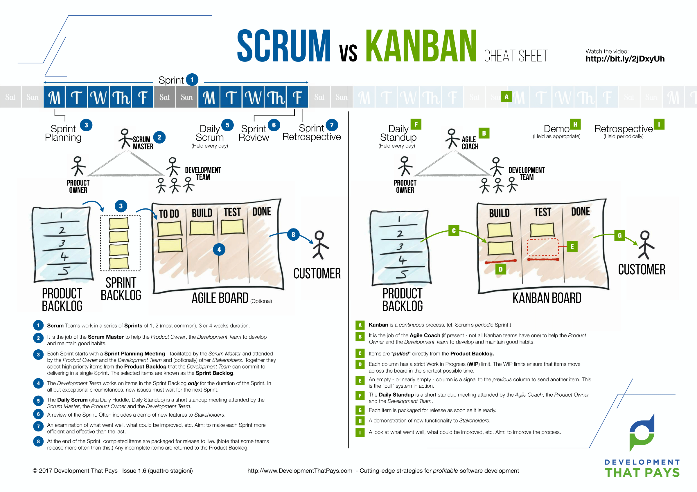

# Agile Development: Scrumban

The two most known agile software development framework are Scrum and Kanban.
The frameworks provide proven ways to increase productivity, minimize waste, improve over time and reduce stress.
Since there are many great articles about the differences between Scrum and Kanban that go into great depth, I am not going to be talking about the two frameworks in general about this article.
There's a great graphic that shows you the differences between the two frameworks.
Have a look in case you are not too familiar with them.

Both frameworks just provide the frame.
Pretty much every team adjusts within the frame to find out what works best for them, and that is totally valid.
Thus, it is also perfectly valid to mix the two frameworks, if it increases productivity.

We called our agile framework **Scrumban** (we didn't come up with the name, it's a common one).
We combined the best of the two frameworks.

Here are the parts of the two frameworks that we worked by:

**Story refinement and planning**

Initially, each story is designed by two to three people.
A product owner, a developer and a business owner.
This worked great for us as developers since at least one developer has participated in writing the story and possibly saved the rest of the team from technologically ineffective/undoable ideas.
When the story is written and approved by at least one developer, it will be presented during refinement.
We had a refinement meeting once a week unless we had super urgent topics that couldn't wait.
During that refinement meeting the product owner and developer presented the story, we talked about it, asked questions, added required information if needed and approved the story.
The story went to the prioritized backlog.

**No estimations**

We did not do any estimations.
As the backlog was prioritized and we just kept on pulling new tasks by that priority, it did not matter.
We did discuss the tickets thoroughly during refinement and did not feel the need to estimate.
During the last few years we haven't estimated at all.
We did have deadlines here and then and put great focus on some tasks, but we did not estimate.

While we did try to keep stories as small as possible, they were also supposed to provide a value.
Sometimes, it is very tough to break a bigger connected task into small units.
With those tasks, we specifically committed to the size of the story and usually paired during development.

**Product backlog**

After refinement, the stories were added to the product backlog.
The backlog was prioritized by the product owners.
The product owners also synchronized with us to make sure the prioritization is understood.
If the story was purely technical, the product owners trusted our estimation of complexity and priority.

**Kanban Board**

Our Kanban Board was our main tool for visualizing the work that is ready to be implemented, is currently being implemented and is done implementing.
The Kanban Board consisted of 4 columns:

* _Ready for development_: The task is refined, prioritized and development can begin.
* _Work in Progress_: The developers are currently working on the task
* _QA_: The task is in quality assurance, meaning the product owner/business owner will verify the quality and correctness of the implemented task
* _Done_: The implementation and quality assurance is done.

We had two lanes, one for stories and one for bugs (each one having the 4 columns mentioned above).
The bug lane always had a priority.
If there is an open bug and a developer needs to choose the next task, it was always bugs first.
When all bugs are resolved, we continue with the stories.

**Visualize the work**

The work has been visualized in multiple ways.
We had a haptic board in the office that was used as the main visualization.
Besides that, we also used Jira to keep track of everything.
The backlog, kanban board and stories were all tracked in Jira.
When everyone started to do Homeoffice due to Covid, we only used Jira.

Besides visualizing the Kanban Board we also had haptic boards for visualizing the bigger roadmap or bigger projects that stretched over multiple months.
It gave a good overview on the upcoming topics (epics).

**Definition of Ready/Done**

We had a definition of ready, meaning:
What needs to be done until a story is ready to be implemented.
It contained:
One developer needs to approve the story before refinement, the refinement itself, proper acceptance criteria and so forth.

Besides the definition of ready, we also had a definition of done, meaning:
What needs to be done until a story is completely done.
It contained:
Quality assurance, updated documentation, notifying the rest of the team about changes and so forth.

**Daily Standup**

Every day at 10am, we meet up and everyone gives an update:
What did you do yesterday?
What are you going to do today?
Do you need help?
Can you offer help?
Are you stuck with a problem? What's blocking you?
Did you learn something that you want to share?

**Communicating product changes**

Every change was communicated in two different channels.
Once a story/bug was completed, we notified the rest of the team in a specific Slack channel (Slack was our main tool for communication), referencing the story in Jira and describing the product changes.

Besides that, every two weeks, the product owners invited the team members (except for developers) for a review.
New product changes were presented.

**Continuous Deployment to production environment**

Since we had a continuous deployment setup, each commit was pushed to the production environment.
We worked with non-breaking changes (having to migrate over multiple deployments) and feature toggles.
The quality assurance was done on the test environment which was as close to the production environment as possible.
All the customer data was anonymized.

**Retrospectives**

Every three weeks, we had a retrospective.
A retrospective is a great way to talk about what went right and what went wrong in the past few weeks and what you can do to improve.
It is extremely important to open up and be honest.
At first, it was hosted by one of the product owners, later on, we also had external agile coaches that moderated the meeting.
The format of the meeting would periodically change to get a different perspective.

Each retrospective started with checking the previous actions and verifying that they were completed successfully.
Afterwards, we collected data (what went right/wrong), voted what we want to talk about, discussed action items, assigned action item owners and finally deadlines.

**Roles**

We did not have a dedicated scrum master or agile coach.
Not because we did not want one, but because we just didn't have the budget to hire one.
The product owners kind of took over and did some things that the agile coach would do.

For retrospectives, we sometimes acquired an external agile coach.
I highly recommend having an external moderator that is not part of the team and moderates agile meetings professionally, it helps a lot.

Since we were a rather small team of six developers, everyone working full-stack (backend, frontend, ops), we did not split the team any further.

**Product Vision**

The product vision was a bigger roadmap, that consisted of multiple epics.
The roadmap was prepared by members of the development team, business team and product owners.
It was aligned with the business goals and provided a good overview of the bigger epics of the upcoming months.
Visualizing the product roadmap and presenting it openly in the office, where everyone can see it, helped focus.