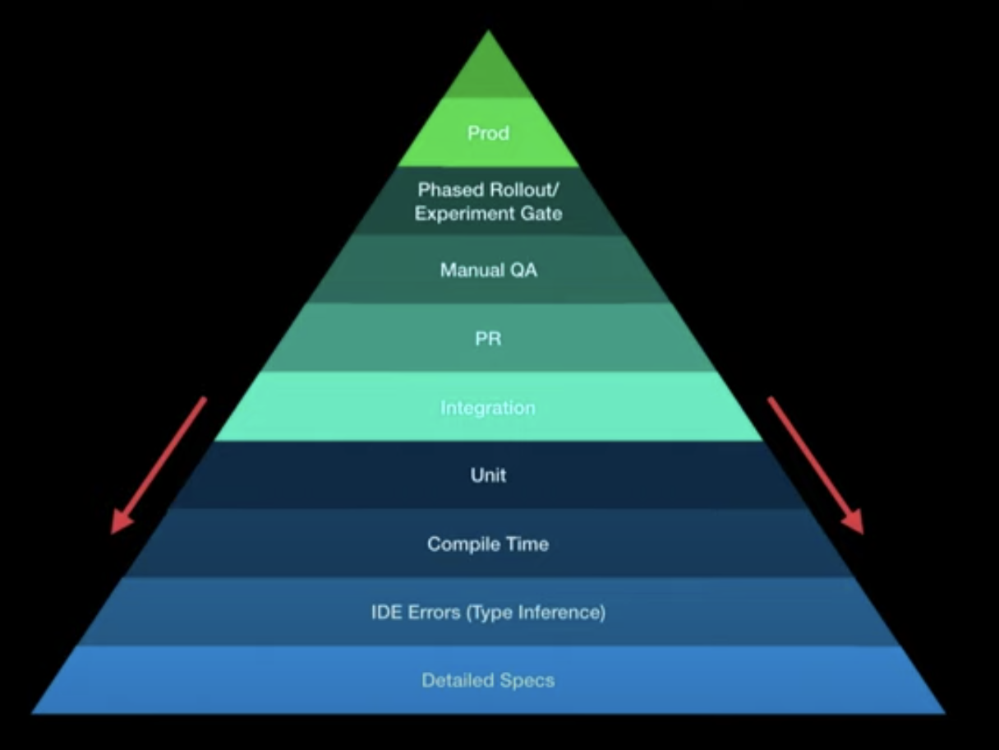

# Testing principles

Testing is a big part of professional software development.
Bad tests or no tests slow you down severely or even break your neck in the long run.
There is no safe way to refactor or extend anything, without proper tests.
In my experience, coverage does not really mean much as a standalone metric.
I could cover almost 100% of code without really making any useful test.
That is why, in my opinion, code coverage should not be any hard criterion.
Yes, you should cover as much as possible.
However, that will happen naturally, if you cover logic and edge cases with your tests.
Please do not write a test for your getter and setter that does nothing but set or return a variable to get code coverage.
It's the same principle for comments.
I don't need a comment explaining that the method `getFoo()` returns foo.
The method name already tells me and I can see the return type.
Anyway, enough of my rant.
I just want you to know that code coverage as a metric does not really mean much, just as number of code lines does not mean anything as a standalone metric.

Most developers know the very simple testing pyramid with unit, integration and end-to-end tests.

We also go by that.
The majority of tests should be unit tests, as they are very quick to execute and encapsulated.
After that, integration tests, the tests stretch over multiple classes and run in a more realistic environment (i.e. embedded PostgreSQL, server context started).
On top of that, end to end test usually run on the deployed service (environment does not matter), they can even test use-cases that stretch across multiple individual services.

However, as shortly mentioned in [Brief overview of the stack](/inside-agile-product-development-series/02-brief-overview-stack/), I think there is a bit more to that.
My colleague and I went to the KotlinConf in 2019 and participated in a [talk by Christina Lee](https://www.youtube.com/watch?v=SIr7mcnVy98).
She came up with the following graphic:

Specifically, she argues that there are a few more layers below the unit testing that should be given more attention.
Naturally, using a type-safe language like Kotlin/Java, you already avoid type interference issues (compared to a non-typed language like JavaScript).
Thus, we used TypeScript in all of our projects.
This won't fully prevent type interference issues, but many of them, during compile time.
Those issues are caught as quickly as possible and prevent you from more severe issues up the pyramid.
As we move up the pyramid, tests get more expensive to implement and maintain, but most importantly to fix.
If you catch an issue during manual QA, that would otherwise be caught in compile time, the whole effort is going to be so much bigger.
That is why you want to catch issues as early as possible.
[Kotlin contracts](https://kotlinlang.org/docs/reference/whatsnew13.html#contracts) are very interesting because you basically extend the compiler, one of the fastest ways to catch issues.
For compilation errors, the developer gets near-instant feedback.

**Unit Tests**

As mentioned before, there should be many unit tests covering your edge cases and business logic.
Unit testing allows mocking dependencies which allows for easy edge-case testing.
You **may** mock dependencies but you should keep that to a minimum as unit tests should be encapsulated.
We found our unit tests to be the most effective when the actual implementation was split in two:

One class that has all the dependencies and another class that implements the actual business logic with a functional approach (data-in, data-out) and ideally zero dependencies.
If your business logic also has 10 different dependencies on top, you will have to mock all of those dependencies and 90% of your unit testing code will just mock code.
That will lead to a difficult maintainability and refactors will most likely break your unit tests and you have to refactor a lot.
Changing a single dependency should not break all of your business logic tests.

**Integration/Acceptance Tests**

As our main stack was Spring Boot and Kotlin, we ran a bunch of integration tests that started up the spring boot application and an embedded PostgreSQL (our database of choice) and whatever was needed to run a rather realistic setup.
The integration tests only covered a few cases, mostly a success and a failure, all the other (edge) cases are covered with unit tests.
When the implementation was split up in a functional way (one service had all the dependencies, other one was purely data-in data-out), we only had to cover the service with the dependencies.

There are multiple entry points for integration tests.
You can start at the highest possible entry (i.e. a HTTP call) that acts like a user to cover the entire stack or enter a bit further down, i.e. the service that actually has the dependencies and executes business logic.
We did both, a few essential integration tests for the most important bits that entered the stack as high as possible, written from a user perspective and service integration tests that mostly covered dependencies.

**UI Tests**

We didn't do much UI testing to be honest.
Not because we thought it's not useful, but it was extremely costly and we had little time to do it.
Initially, there were some Selenium tests that covered some very basic cases.
Over the time, since we didn't put much effort in those tests, they became flaky and unmaintainable and we removed them.
A great alternative is [Cypress.io](https://www.cypress.io/).
Anyone who knows the pain of working with flaky UI tests should give Cypress a try.

**Manual QA**

The manual QA was done by the business or product owner, mostly in collaboration with the developer.
No matter how good your tests are, manual QA is super important.
As we kept the feedback loop as short as possible, we usually did manual QA during implementation as well and presented partial results to the business/product owner.
This kept the final manual QA when the implementation was done pretty short.

**Toolchain**

We did not have specific rules on how to test things.
There was no rule saying "We have to do every test behavior-driven" or whatever.
However, we tried to provide the tools for the developers so they **could** make use of that.
A central library for testing provided the tooling and setup for unit and integration tests.
It included mocking (mockito), assertion (assertk), behavior-driven-testing (cucumber), integration testing (spring-test), helper methods for the most common tests (i.e. testing roles for HTTP endpoints) and so on.
In our weekly developer meetup, we exchanged ideas and improvements on testing.
For example, I made a proof of concept for behavior-driven-tests and we decided to add it to the toolchain, but let developers decide, when to use it.
Providing an easy-to-use toolchain for developers is a must-have.
It shouldn't be painful to write tests.
Ultimately, you should put a lot of effort in non-flaky, fast and easier test-tooling to be as productive as possible.

**Feedback Loop**

One of the most important bits in productivity is keeping the feedback loop as short as possible.
This is important during all types of testing.
If you implement something for a week, throw that over the fence for manual QA, manual QA starts three days later, you get feedback on the fourth day, already caught up in new stories, finishing that story will take forever.
You want to keep the feedback loop as short as possible.
Catch compile time errors, run unit and integration tests as quick as possible, run test deployments quickly to preview it in a realistic environment and talk to the story owner **during implementation**.
Talking to people and keeping the feedback loop sounds easy, but many teams that call themselves agile don't do it.
It's still the good ol' "throw it over the fence".
If you want to be more productive, make the developers and the story owners happy, talk to each other and keep that feedback loop and tooling short.