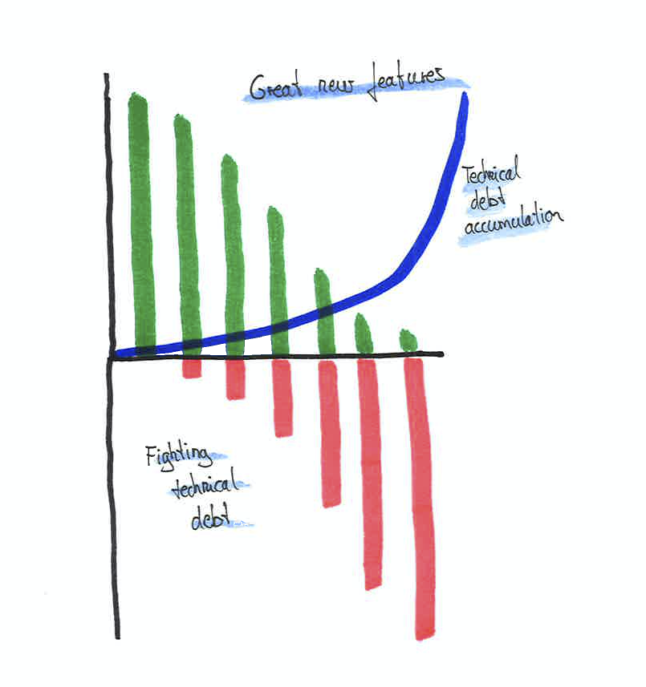

# Technical debt and refactoring

No team can entirely avoid technical debt.
To some degree, you will build up technical debt.
There are many reasons for technical debt to occur:

Time pressure, not knowing any better solution, underestimating the impact, not enough communication, priority on new features, ...

It's important to not lose track of it and keep adding features on top of your technical flaws, otherwise you might end up in the feature trap.

Take a look at the image above (taken from [scrum.org](https://www.scrum.org/resources/blog/technical-debt-product-owners)) - it demonstrates the trap many teams fall into.
As great new features keep being added, the technical debt is ignored.
Piling up the technical debt decreases the speed of feature implementation.
Eventually, the technical debt will be so high, that you can barely develop any new feature and it slows you down almost to a stop.
Thus, it is crucial to pay attention to your technical debt.
I know, building fancy new features is more fun, but being in that feature trap is no fun at all, believe me.

In our business model, we tried out many things and kept adjusting.
Requirements were changing **rapidly**.
Meaning we had to constantly change a lot of code.
At some point, when we iterated on a feature for several times, it was kind of forgotten.
Not just from a technical point of view, but also a business/procedural point of view.
We moved to new features, improvements and bug fixes and lost track of it.
Every time we did that without constantly keeping an eye on it, re-adjusting and tightening the requirements, this came back like a boomerang with spikes.
Sometimes we would only find a major flaw in the design (not a technical issue, but procedural) month later.
By then, so much shit piled up, that it took a very long time to re-think the process, fix it and make the best of that old data.
In hindsight, I would have done those things differently.
Taking more time to think about the process, continuously monitor and active alert business issues (on top of technical ones).

The extremely short feedback loop allowed us to quickly iterate features, re-adjust and so on.
Up until initial feature completion, we did very well.
One thing that we really lacked was the continuous monitoring of the features.

Whenever we had some technical debt we wanted to fix, the product managers trusted the developers' assessment.
If the developers said it is urgent or should be fixed soon, they trusted us and we were able to tackle the issue.

As we worked with Scrumban, we didn't reserve a specific amount of time for refactorings or bug fixes.
Some people say, if you come to the point where you have to reserve a certain percentage of your time for refactorings, you're already in big trouble.
Bug fixes always had the highest priority for us.
Before doing any story, all bugs needed to be fixed first.
If you pile up bugs or technical debt and ignore them for a little too long, they will haunt you and slow you down so much, you're almost not moving at all.

For a while, whenever a bug occurred, we only fixed that specific occurrence, usually a consequence of old processes that lacked a data cleanup and proper investigation.
Those bugs kept reoccurring from time to time.
It was costly to analyze and usually pretty mind-boggling.
In a retrospective we complained about having too many bugs, preventing us from actually developing improvements and features.
We decided to tackle each bug at the root.
For the first few weeks we spend a lot more time on bugs.
However, we were able to eliminate nearly all the recurring bugs by digging deep into the problem and solving the issue at the root of the problem.
That was a great example on how technical debt and not attacking the root of the issue can slow you down considerably in the long run.
Do not underestimate that impact.

Another technical flaw that we ignored for a long time was our delta import/export mechanism.
As we had a distributed architecture (microservices), we needed to sync data between services.
The synchronization was done using a delta import/export.
Each service saved its own representation of the data needed from another service (i.e. order-service saving some customer-service data).
One thing we ignored in the beginning was the permanent deletion of data.
To be GDPR compliant, you need to be able to fully delete data, for example when there is no business connection to the customer and that customer hasn't logged in for two years.
We did have a way to flag data as deleted, but not cascade the permanent deletion in all corresponding services automatically.
We could have added deletion in the delta export mechanism, but the design would have been pretty bad.
Thus, we decided to completely re-work data synchronization and had to refactor it in 17 services in a non-breaking way.
That took some time.
Probably a lot more time compared to respecting that criterion from the very beginning or tackling the issue earlier.

As we had a continuous deployment to the production environment, meaning every commit to the main branch landed in production (given the tests and test deployment were successful), every change had to be in a non-breaking way.
In bigger procedural refactorings with old, possibly flawed or incomplete data, that was a challenge.
We tried to keep our testing environment as close as possible to the production environment.
However, some external services provided by third party providers may not offer test environments and the data on the test environment is completely anonymized (Yours isn't or only partially? Take action now before you learn it the hard way).
On bigger refactorings, we would usually pair program.
Besides that, we ran many dry-runs on test and production data to make sure we don't mess up.

New architectural changes to tackle technical debt were also done in a non-breaking way, starting in a single service and figuring out the best way to do it.
Later on, that change was applied to all other services and eventually any remains of the technical debt were removed.