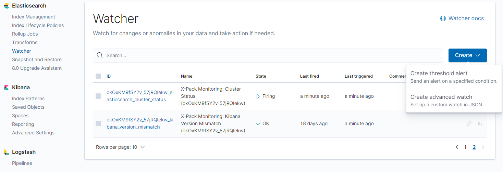

# Alerting downtimes in Slack using Heartbeat and Kibana Watchers

This is a two parts series, check out the first part, [Elastic Heartbeat uptime and latency monitoring](/posts/2020-02-02-elastic-heartbeat-uptime-latency-monitoring).

To setup an alerting, we can use [Kibana's Watcher](https://www.elastic.co/guide/en/kibana/current/watcher-ui.html).

In Kibana, go to Management > WatcherYou have to create an advanced watch (JSON) to do this.



Our alert will do the following:

Check every minute, if atleast two failed pings occured for each service we are monitoring.
If two pings failed for one service, we want to get an alert via Slack.

First, the complete example, which we'll break down afterwards

```json
{
  "trigger": {
    "schedule": {
      "interval": "1m"
    }
  },
  "input": {
    "search": {
      "request": {
        "search_type": "query_then_fetch",
        "indices": [
          "heartbeat-*"
        ],
        "rest_total_hits_as_int": true,
        "body": {
          "size": 0,
          "query": {
            "bool": {
              "must": [
                {
                  "term": {
                    "monitor.status": {
                      "value": "down"
                    }
                  }
                }
              ],
              "filter": [
                {
                  "range": {
                    "@timestamp": {
                      "from": "now-2m"
                    }
                  }
                }
              ]
            }
          },
          "aggregations": {
            "by_monitors": {
              "terms": {
                "field": "monitor.name",
                "size": 10,
                "min_doc_count": 1
              }
            }
          }
        }
      }
    }
  },
  "condition": {
    "compare": {
      "ctx.payload.hits.total": {
        "gt": 1
      }
    }
  },
  "actions": {
    "notify-slack": {
      "throttle_period_in_millis": 300000,
      "slack": {
        "message": {
          "from": "Heartbeat",
          "to": [
            "#ops"
          ],
          "text": "Some systems are not replying.",
          "dynamic_attachments": {
            "list_path": "ctx.payload.aggregations.by_monitors.buckets",
            "attachment_template": {
              "color": "warning",
              "title": "{{key}}",
              "text": "Amount of events: {{doc_count}}"
            }
          }
        }
      }
    }
  }
}
```

Let's break this down.

```json
"trigger": {
    "schedule": {
      "interval": "1m"
    }
  }
```

The trigger defines, when the watcher should be triggered.
In this case, the watcher is triggered every minute.

---

```json
"indices": [
    "heartbeat-*"
]
```

We'll define which indices should be searched, with the wildcard, any heartbeat index is picked up.

---

```json
"query": {
    "bool": {
        "must": [
        {
            "term": {
            "monitor.status": {
                "value": "down"
            }
            }
        }
        ],
        "filter": [
        {
            "range": {
            "@timestamp": {
                "from": "now-2m"
            }
            }
        }
        ]
    }
}
```

The query is an Elasticsearch query.

We search for entries where the field `monitor.status` equals `down` and the timestamp of the event is within the last two minutes.

Why two minutes? Because we only want to alert when there are two down events occuring, so that a single flaky network call won't alert us instantly.

---

```json
"aggregations": {
    "by_monitors": {
        "terms": {
        "field": "monitor.name",
        "size": 10,
        "min_doc_count": 1
        }
    }
}
```

Heartbeat monitors should have an understandable name.
This way we can also output that name in the alert.

We aggregate by the name.
If we have multiple down events for different systems, we want to aggregate by the system name.

So if we have one failed ping from our system Service-A and another failed ping from our system Service-B, that will not trigger an alert, because we aggregated by name and each only has a single ping failure.

---

```json
"condition": {
    "compare": {
      "ctx.payload.hits.total": {
        "gt": 1
      }
    }
  }
```

The condition makes sure that we have atleast two failed pings (amount of hits is greater than 1).

---

```json
"actions": {
    "notify-slack": {
        "throttle_period_in_millis": 300000,
        "slack": {
            "message": {
            "from": "Heartbeat",
            "to": [
                "#ops"
            ],
            "text": "Some systems are not replying.",
            "dynamic_attachments": {
                "list_path": "ctx.payload.aggregations.by_monitors.buckets",
                "attachment_template": {
                    "color": "warning",
                    "title": "{{key}}",
                    "text": "Amount of events: {{doc_count}}"
                    }
                }
            }
        }
    }
}
```

We use a [Slack action](https://www.elastic.co/guide/en/elasticsearch/reference/current/actions-slack.html) and send a message to the `#ops` channel.
By defining a list_path on our aggregation, the slack message will contain a list of systems that are down by their names.

The `throttle_period_in_millis` defines a notification throttle in milliseconds.
In this case we will only get a notification once every five minutes.


If you like this post, feel free to follow me or hit me up on [Twitter](https://twitter.com/kevcodez).