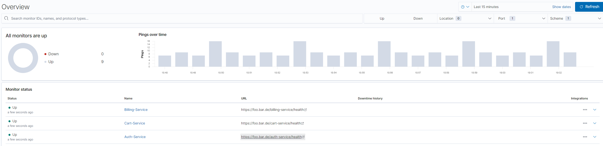
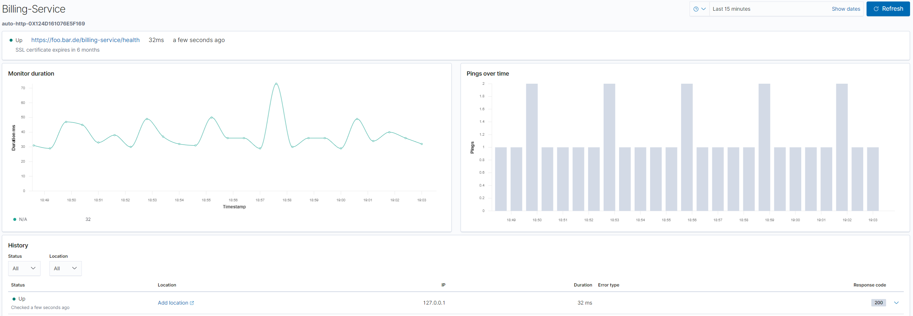

# Monitor uptime and latency with Elastic's Heartbeat

[Heartbeat](https://www.elastic.co/beats/heartbeat) is a lightweight shipper for uptime monitoring.
Elastic explains it well

> Monitor services for their availability with active probing.
> Given a list of URLs, Heartbeat asks the simple question:
> Are you alive?
> Heartbeat ships this information and response time to the rest of the Elastic Stack for further analysis.

Heartbeat can easily be configured using YAML, pings your targets and sends the information to Logstash or straight to Elasticsearch.

Supported transfer protocols are ICMP, TCP, and HTTP. TLS, authentication and proxies are supported aswell. 

On top of that, Kibana offers great visualization.

We are going to learn:

- Basic configuration and concepts of Heartbeat
- Running Heartbeat locally or via Docker
- Packaging your own Dockerfile
- Visualizing your data in Kibana
- Alerting downtimes using Kibana Watchers and Slack

This is a two-parts series, check out the second part, [alerting uptime with Kibana watchers](/posts/2020-02-02-alerting-kibana-uptime).

## Configuration

As for configuration, a simple YAML file is used.

```yml
heartbeat.monitors:
- type: http
  schedule: '@every 5s'
  urls:
    - http://elasticsearch:9200
    - http://kibana:5601

- type: icmp
  schedule: '@every 5s'
  hosts:
    - elasticsearch
    - kibana

fields:
  environment: prod

output.elasticsearch:
  hosts: '${ELASTICSEARCH_HOSTS:elasticsearch:9200}'
  username: '${ELASTICSEARCH_USERNAME:}'
  password: '${ELASTICSEARCH_PASSWORD:}'
```

I will explain the most common/important parts of the configuration, there is [a lot more to configure](https://www.elastic.co/guide/en/beats/heartbeat/7.5/heartbeat-reference-yml.html).

### Monitors

The **heart** of heartbeat are monitors (pun intended).
Each monitor has a type (transport protocol: *http*/*icmp*/*tcp*), a schedule (when to check) and a list of urls.

```yaml
- type: http
  schedule: '@every 5s'
  urls:
    - http://elasticsearch:9200
    - http://kibana:5601
```

This monitor will do a HTTP call on `http://elasticsearch:9200` and `http://kibana:5601` every 5 seconds and by default check for a 200 status code.

---

```yaml
- type: http
  schedule: '@every 1m'
  urls:
    - https://my-basic-auth-protected-rurl.com
  username: foo
  password: bar
```

This monitor will do a HTTP call on `https://my-basic-auth-protected-rurl.com` with the basic auth credentials `foo:bar`.

---

```yaml
- type: http
  schedule: '@every 5s'
  urls: ["http://localhost:8080/demo/add"]
  check.request:
    method: POST
    headers:
      'Content-Type': 'application/x-www-form-urlencoded'
    # urlencode the body:
    body: "name=first&email=someemail%40someemailprovider.com"
  check.response:
    status: 200
    body:
      - Saved
      - saved
```

Issue a POST request every 5 seconds to http://localhost:8080/demo/add, with the specified header and body, expecting a 200 HTTP response code and a response body containg one of the given regular expressions.

---

```yml
- type: http
  schedule: '@every 5s'
  hosts: ["https://myhost:80"]
  check.request:
    method: GET
    headers:
      'X-API-Key': '12345-mykey-67890'
  check.response:
    status: 200
    json:
      - description: check status
        condition:
          equals:
            status: ok
```

To check that a specific field in the JSON response body matches something, you can use the `check.response.json` matcher.

Check further configuration options in the [official docs](https://www.elastic.co/guide/en/beats/heartbeat/7.5/configuration-heartbeat-options.html).

### Fields

Optional fields that you can specify to add additional information to the monitor output.
Fields can be scalar values, arrays, dictionaries, or any nested combination of these.

### Processors

Processors are used to reduce the number of fields in the exported event or to enhance the event with external metadata. 

Check out the [full documentation on processors](https://www.elastic.co/guide/en/beats/heartbeat/7.5/defining-processors.html).

### Output

Heartbeat will send the collected data every X seconds to the configured output.

Supported outputs are:

- Elasticsearch
- Logstash
- Kafka
- Redis
- File
- Console
- Elastic Cloud

### Using environment variables

You can use environment variable references in the config file to set values that need to be configurable during deployment. To do so, simply use: `${VAR}`

Some examples

```yml
cloud.auth: "${ELASTIC_CLOUD_USERNAME}:${ELASTIC_CLOUD_PASSWORD}"

username: ${WIRECARD_USERNAME}
password: ${WIRECARD_PASSWORD}

urls:
    - https://api.foo.com/products?query=test&apiKey=${API_KEY}
```

## Running heartbeat

We'll start with the most simple example.
Check kevcodez.de every 10 seconds and print the results to the console.

heartbeat.yml
```yml
heartbeat.monitors:
- type: http
  urls: ["https://kevcodez.de"]
  name: Kevcodez
  schedule: '@every 10s'

output.console:
  pretty: true
```

We are setting a **name** here, otherwise it will get a cryptic name in the Kibana Uptime dashboard.

### Locally

Download the appropriate package [here](https://www.elastic.co/downloads/beats/heartbeat).
Heartbeat also has packages for yum, apt-get and homebrew.

After unpacking, we'll place the configuration above in the same folder.

To execute heartbeat, simply run `heartbeat -e`.

```sh
....
2020-02-02T18:54:18.253+0100    INFO    instance/beat.go:297    Setup Beat: heartbeat; Version: 7.5.2
2020-02-02T18:54:18.254+0100    INFO    [publisher]     pipeline/module.go:97   Beat name: DESKTOP-xyz
2020-02-02T18:54:18.254+0100    INFO    instance/beat.go:429    heartbeat start running.
2020-02-02T18:54:18.254+0100    INFO    [monitoring]    log/log.go:118  Starting metrics logging every 30s
2020-02-02T18:54:18.255+0100    INFO    beater/heartbeat.go:80  heartbeat is running! Hit CTRL-C to stop it.
```

After a few seconds, the first ping should be sent to the console.

```json
{
  "@timestamp": "2020-02-02T17:54:28.259Z",
  "@metadata": {
    "beat": "heartbeat",
    "type": "_doc",
    "version": "7.5.2"
  },
  "tls": {
    "certificate_not_valid_after": "2020-03-20T14:20:38.000Z",
    ...
    "certificate_not_valid_before": "2019-12-21T14:20:38.000Z"
  },
  "http": {
    "response": {
      "body": {
        "bytes": 13029,
        "hash": "8f51d9f9c36306bcf381c4c832bbc5add93ff30b9a428ef1a2a87a8ef68a977f"
      },
      "status_code": 200
    },
    ...
  },
  ...
  "url": {
    "scheme": "https",
    "domain": "kevcodez.de",
    "port": 443,
    "full": "https://kevcodez.de"
  },
  "tcp": {
    ...
  },
  "monitor": {
    "check_group": "089d22a3-45e5-11ea-ad0d-00155d6ef166",
    "ip": "157.230.120.63",
    "status": "up",
    "duration": {
      "us": 704078
    },
    "type": "http",
    "id": "auto-http-0X858C739E5BD0C5CC",
    "name": "Kevcodez"
  },
  "summary": {
    "down": 0,
    "up": 1
  },
  ...
}
```

Heartbeat is up and running.
We may now change the monitors and output.

### Docker

Elastic offers an official docker image in their own [docker repository](https://www.docker.elastic.co/).

To run the docker image with your heartbeat.yml file, run:

```sh
docker run -d \
  --name=heartbeat \
  --user=heartbeat \
  --volume="$(pwd)/heartbeat.yml:/usr/share/heartbeat/heartbeat.yml:ro" \
  docker.elastic.co/beats/heartbeat:7.5.2 
```

## Packaging your own docker image

To dockerize heartbeat with your custom heartbeat configuration, check out the following Dockerfile, it's pretty self-explanatory:

```Dockerfile
FROM docker.elastic.co/beats/heartbeat:7.5.2
COPY heartbeat.yml /usr/share/heartbeat/heartbeat.yml
USER root
RUN chown root:heartbeat /usr/share/heartbeat/heartbeat.yml
USER heartbeat
```

[Official Docs for running Heartbeat on Docker](https://www.elastic.co/guide/en/beats/heartbeat/7.5/running-on-docker.html)

## Kibana

Kibana has an **Uptime** tab to visualize Heartbeat pings.
On top of that, alerting can be configured to alert you in case of a downtime.

### Visualization

The main dashboard for the uptime view shows you a quick overview of your services and their status.



If you select a service, you can see all the pings and the latencies for each.



### Alerting

Check out the second part, [alerting uptime with Kibana watchers](/posts/2020-02-02-alerting-kibana-uptime).

If you like this post, feel free to follow me or hit me up on [Twitter](https://twitter.com/kevcodez).