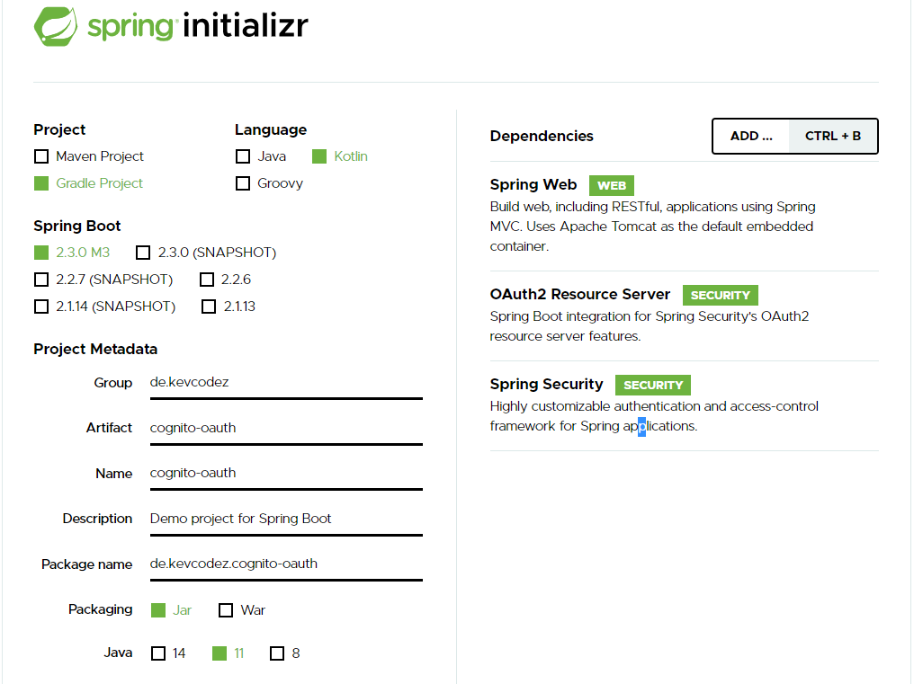

# Secure your Spring Boot App with Json Web Tokens and OAuth 2.0 provided by AWS Cognito

Personally, I hate this topic.
I do it every few years and by then I have forgotten everything I knew about [OAuth](https://www.oauth.com/) flows and the confusion begins again.

This tutorial assumes that you separate your login app from your Spring Boot service and only want to verify the tokens and scopes in the app.
Additionaly, I assume you have already set up [AWS Cognito](https://aws.amazon.com/cognito/) and are able to generate access tokens.

There are quite a few articles about Spring and OAuth.
However, Spring Security advances fast and things get outdated quickly.

Since there are many good articles about OAuth/AWS Cognito Setup out there, I am going to get into the code right away.

## Basic setup

Let's quickly initialize a new project using the great [Spring Initializr](https://start.spring.io/).

Again, we only want to *verify* the tokens sent to our application and make sure the user is authanticated and has the proper roles to execute function.

We do *not* want to create custom login pages or anything similar in this tutorial.



We need the following modules:

* Spring-Security
* Spring Web
* OAuth2 Resource Server

To test the authorization, let us create a very simple controller:

```kotlin
import org.springframework.web.bind.annotation.GetMapping
import org.springframework.web.bind.annotation.RestController

@RestController
class TestController {
    
    @GetMapping("/hello")
    fun hello(): String {
        return "I am authenticated"
    }
}
```

Let's configure spring, so we can actually verify tokens and make sure the user is authenticated.

```yml
spring:
  security:
    oauth2:
      resourceserver:
        jwt:
          issuer-uri: https://cognito-idp.<aws-region>.amazonaws.com/<cognito-pool-id>
```

You can find your cognito pool id under **General Settings > Pool Id**.

That's it.
Crazy right?

AWS Cognito provides informations about endpoints and public certificates under the URL `https://cognito-idp.*aws-region*.amazonaws.com/*pool-id*/.well-known/openid-configuration#`.

```json
{
   "authorization_endpoint":"https://xx.auth.eu-central-1.amazoncognito.com/oauth2/authorize",
   "id_token_signing_alg_values_supported":[
      "RS256"
   ],
   "issuer":"https://cognito-idp.eu-central-1.amazonaws.com/eu-central-xx",
   "jwks_uri":"https://cognito-idp.eu-central-1.amazonaws.com/eu-central-xx/.well-known/jwks.json",
   "response_types_supported":[
      "code",
      "token"
   ],
   "scopes_supported":[
      "openid",
      "email",
      "phone",
      "profile"
   ],
   "subject_types_supported":[
      "public"
   ],
   "token_endpoint":"https://xx.auth.eu-central-1.amazoncognito.com/oauth2/token",
   "token_endpoint_auth_methods_supported":[
      "client_secret_basic",
      "client_secret_post"
   ],
   "userinfo_endpoint":"https://xx.auth.eu-central-1.amazoncognito.com/oauth2/userInfo"
}
```

Spring will fetch all the necessary information needed to verify tokens on startup.
The tokens are encrypted with an RSA signature with SHA-256.
The public key is enough to verify the tokens are legit.

Let's verify it is actually working.

When requesting the endpoint without any authorization, we should run into 401 unauthorized.

```sh
curl -o /dev/null -s -w "%{http_code}\n" http://localhost:8080/hello

401
```

As mentioned earlier, I expect you to have a setup where you can actually get access tokens.

```sh
curl -o /dev/null -s -w "%{http_code}\n" -H "Authorization: Bearer ey..." http://localhost:8080/hello

200
```

Tokens get verified and we can access the endpoint.

### Check user groups

If you want to verify that a user is in a specific group, you need to configure a little bit to let Spring know how to extract the roles out of the Cognito json web tokens.

```kotlin
@EnableWebSecurity
class MyCustomSecurityConfiguration : WebSecurityConfigurerAdapter() {
    override fun configure(http: HttpSecurity) {
        http
            .authorizeRequests { authorize ->
                authorize
                    .anyRequest().authenticated()
            }
            .oauth2ResourceServer { oauth2 ->
                oauth2
                    .jwt { jwt ->
                        jwt.jwtAuthenticationConverter(grantedAuthoritiesExtractor())
                    }
            }
    }

    private fun grantedAuthoritiesExtractor(): JwtAuthenticationConverter {
        val jwtAuthenticationConverter = JwtAuthenticationConverter()

        jwtAuthenticationConverter.setJwtGrantedAuthoritiesConverter { jwt ->
            val list: List<String> = jwt.claims.getOrDefault("cognito:groups", emptyList<String>()) as List<String>

            return@setJwtGrantedAuthoritiesConverter list
                .map { obj: Any -> obj.toString() }
                .map { role -> SimpleGrantedAuthority(role) }
        }

        return jwtAuthenticationConverter
    }
}
```

You can now get the assigned roles by accessing the security context holder:

```kotlin
SecurityContextHolder.getContext().authentication.authorities
```

If you want to be a able to annotate your methods to secure them like this:

```kotlin
@GetMapping("/hello")
@PreAuthorize("hasAuthority('user')")
fun hello(): String {
    return "I am authenticated"
}
```

You need to enable global method security.

```kotlin
import org.springframework.context.annotation.Configuration
import org.springframework.security.config.annotation.method.configuration.EnableGlobalMethodSecurity
import org.springframework.security.config.annotation.method.configuration.GlobalMethodSecurityConfiguration

@Configuration
@EnableGlobalMethodSecurity(prePostEnabled = true, securedEnabled = true, jsr250Enabled = true)
class MethodSecurityConfig : GlobalMethodSecurityConfiguration()
```

That was pretty quick to setup right?

You can find the source on [Github](https://github.com/kevcodez/spring-boot-2.3-oauth2-aws-cognito).

If you like this post, feel free to follow me or hit me up on [Twitter](https://twitter.com/kevcodez).